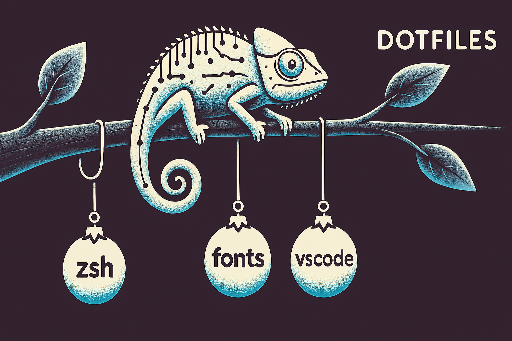
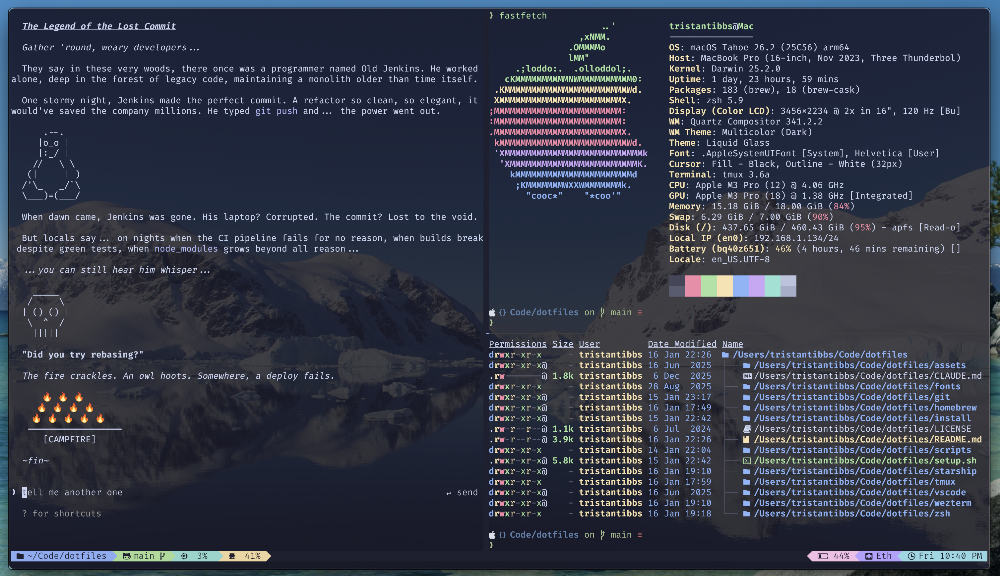

# Dotfiles

Personal configuration for a consistent dev environment across macOS and Linux.

## Features

### Terminal Stack
- **WezTerm** - GPU-accelerated terminal with Catppuccin theme, fancy tabs, background image
- **Tmux** - Terminal multiplexer with session persistence and popup scratchpads
- **Starship** - Cross-shell prompt with git integration and directory icons
- **Zsh** - Shell with modern CLI tool aliases

### What's Included

| Category | Tools |
|----------|-------|
| Terminal | WezTerm, tmux, starship |
| Shell | zsh, aliases, exports |
| CLI Tools | eza, bat, dust, procs, fd, fzf, btop, tldr |
| Git | Conditional identity (personal/work), delta diffs |
| AI | Claude Code & Gemini CLI aliases |

## Installation

```bash
git clone https://github.com/tctibbs/dotfiles.git
cd dotfiles
./setup.sh
```

## Key Bindings

### Tmux (Prefix: Ctrl-a)

| Key | Action |
|-----|--------|
| `\|` | Split horizontal |
| `-` | Split vertical |
| `g` | LazyGit popup |
| `a` | Claude AI popup |
| `b` | btop popup |
| `s` | Session picker |

### WezTerm

| Key | Action |
|-----|--------|
| `Cmd+Enter` | Toggle fullscreen |
| `Cmd+T` | New tab |
| `Cmd+W` | Close tab |
| `Cmd+Shift+R` | Rename tab |
| `Ctrl+Shift+\|` | Split horizontal |
| `Ctrl+Shift+_` | Split vertical |

## CLI Tool Aliases

| Tool   | Replaces     | Description                                     |
|--------|--------------|-------------------------------------------------|
| `eza`  | `ls`         | Modern replacement with color, icons, tree view |
| `bat`  | `cat`        | Syntax-highlighted file viewer with pager       |
| `dust` | `du`         | Visual disk usage analyzer                      |
| `procs`| `ps`         | Improved process viewer with color and layout   |
| `fd`   | `find`       | Fast, user-friendly file search tool            |
| `tldr` | `man`        | Simplified community-driven command help        |
| `btop` | `htop`/`top` | Resource monitor with charts and themes         |
| `fzf`  | -            | Fuzzy finder for command-line                   |

## AI CLI Aliases

| Alias | Command | Description |
|-------|---------|-------------|
| `cc`  | `claude --dangerously-skip-permissions` | Claude Code |
| `ccc` | `claude --dangerously-skip-permissions -c` | Claude Code continue |
| `gf`  | `gemini --model gemini-2.5-flash` | Gemini Flash |

## Documentation

- [VSCode Integration](docs/vscode.md) - Auto-deploy dotfiles on remote SSH connections

## Screenshot


