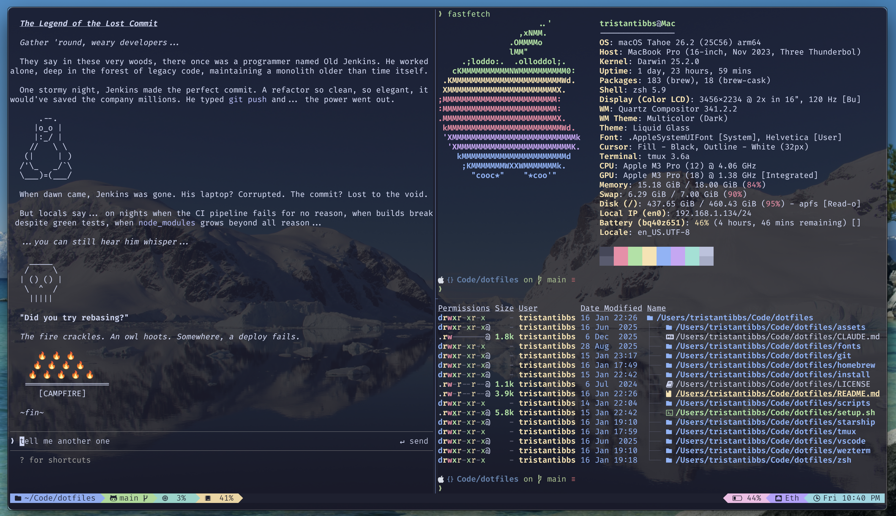

# Dotfiles



Personal configuration for a consistent dev environment across macOS, Linux, and Windows.

## Features

### Terminal Stack
- **WezTerm** - GPU-accelerated terminal with Catppuccin theme, fancy tabs, background image
- **Windows Terminal** - Native Windows terminal with matching Catppuccin theme, acrylic blur, background image
- **Tmux** - Terminal multiplexer with session persistence and popup scratchpads
- **Starship** - Cross-shell prompt with git integration and directory icons
- **Zsh** - Shell with modern CLI tool aliases

### What's Included

| Category | Tools |
|----------|-------|
| Terminal | WezTerm, Windows Terminal, tmux, starship |
| Shell | zsh, aliases, exports |
| CLI Tools | eza, bat, dust, procs, fd, fzf, btop, tldr, fastfetch |
| Git | Conditional identity (personal/work), delta diffs |
| AI | Claude Code & Gemini CLI aliases |

## Installation

### Quick Start (New Machine)

```bash
# One command installs chezmoi + applies dotfiles
sh -c "$(curl -fsLS get.chezmoi.io)" -- init --apply tctibbs/dotfiles
```

You'll be prompted for:
- **identity**: `personal` or `work` (sets git email)
- **profile**: `full`, `lite`, or `minimal` (controls package installation)

### Manual Installation

```bash
# Clone and initialize
git clone https://github.com/tctibbs/dotfiles.git ~/dotfiles
cd ~/dotfiles

chezmoi init --source=. --apply
```

### Install Profiles

| Profile | Description |
|---------|-------------|
| `full` | Everything: GUI apps (WezTerm, VSCode), fonts, all CLI tools |
| `lite` | All CLI tools, skip GUI apps and fonts (for SSH, containers) |
| `minimal` | Just shell and git config (fastest) |

### Windows

```powershell
# Install chezmoi via winget
winget install twpayne.chezmoi

# Apply dotfiles
chezmoi init --apply tctibbs/dotfiles
```

## Daily Usage

```bash
chezmoi diff          # Preview changes
chezmoi apply         # Apply changes
chezmoi edit ~/.zshrc # Edit source, auto-applies
chezmoi add ~/.newfile # Add new dotfile to management
chezmoi cd            # Go to source directory
chezmoi update        # Pull latest and apply
```

## Key Bindings

### Tmux (Prefix: Ctrl-a)

| Key | Action |
|-----|--------|
| `\|` | Split horizontal |
| `-` | Split vertical |
| `g` | LazyGit popup |
| `a` | Claude AI popup |
| `b` | btop popup |
| `s` | Session picker |

### WezTerm

| Key | Action |
|-----|--------|
| `Cmd+Enter` | Toggle fullscreen |
| `Cmd+T` | New tab |
| `Cmd+W` | Close tab |
| `Cmd+Shift+R` | Rename tab |
| `Ctrl+Shift+\|` | Split horizontal |
| `Ctrl+Shift+_` | Split vertical |

### Windows Terminal

| Key | Action |
|-----|--------|
| `Ctrl+Enter` | Toggle fullscreen |
| `Ctrl+T` | New tab |
| `Ctrl+W` | Close tab |
| `Alt+1-5` | Switch to tab 1-5 |
| `Ctrl+Shift+\` | Split vertical |
| `Ctrl+Shift+-` | Split horizontal |
| `Ctrl+Shift+Arrow` | Navigate panes |
| `Ctrl+Shift+W` | Close pane |

## CLI Tool Aliases

| Tool   | Replaces     | Description                                     |
|--------|--------------|-------------------------------------------------|
| `eza`  | `ls`         | Modern replacement with color, icons, tree view |
| `bat`  | `cat`        | Syntax-highlighted file viewer with pager       |
| `dust` | `du`         | Visual disk usage analyzer                      |
| `procs`| `ps`         | Improved process viewer with color and layout   |
| `fd`   | `find`       | Fast, user-friendly file search tool            |
| `tldr` | `man`        | Simplified community-driven command help        |
| `btop` | `htop`/`top` | Resource monitor with charts and themes         |
| `pgcli`| `psql`       | PostgreSQL CLI with auto-completion             |
| `mycli`| `mysql`      | MySQL CLI with auto-completion                  |
| `litecli`| `sqlite3`  | SQLite CLI with auto-completion                 |
| `gobang`| -           | Database TUI for multiple databases             |
| `fzf`  | -            | Fuzzy finder for command-line                   |
| `fastfetch` | `neofetch` | Fast system info display                    |
| `repomix` | -            | Pack repo into AI-friendly file             |
| `mcat`  | -              | Render markdown in terminal                   |
| `treemd`| `tree`         | Generate markdown directory trees             |
| `onefetch`| -            | Git repo info display (like neofetch for repos)|
| `yazi`  | -              | Terminal file manager with previews             |

## AI CLI Aliases

| Alias | Command | Description |
|-------|---------|-------------|
| `cc`  | `claude --dangerously-skip-permissions` | Claude Code |
| `ccc` | `claude --dangerously-skip-permissions -c` | Claude Code continue |
| `gf`  | `gemini --model gemini-2.5-flash` | Gemini Flash |

## Architecture

### Repository Structure

```
dotfiles/
├── .chezmoiroot                  # Points chezmoi at home/
├── README.md
├── docs/                         # Guides and documentation
├── assets/                       # Screenshots
│
└── home/                         # Chezmoi source root
    ├── .chezmoi.yaml.tmpl        # Machine config (identity, profile)
    ├── .chezmoiignore            # Conditional file ignores
    │
    ├── dot_zshrc                 # ~/.zshrc
    ├── dot_gitconfig.tmpl        # ~/.gitconfig (templated)
    ├── dot_gitconfig-work        # ~/.gitconfig-work
    ├── dot_tmux.conf             # ~/.tmux.conf (+mac/linux variants)
    ├── dot_wezterm.lua           # ~/.wezterm.lua
    │
    ├── private_dot_config/       # ~/.config/
    │   ├── zsh/                  # Shell aliases and exports
    │   ├── wezterm/              # WezTerm modules (keys, tabs, theme)
    │   ├── Code/User/            # VS Code settings and custom CSS
    │   ├── fastfetch/            # System info config
    │   └── starship.toml         # Prompt config
    │
    ├── private_dot_local/        # ~/.local/
    │   └── private_bin/          # Custom scripts
    │
    ├── Documents/PowerShell/     # Windows PowerShell profile
    ├── AppData/.../              # Windows Terminal settings
    │
    └── .chezmoiscripts/          # Install and setup scripts
        ├── run_once_before_00-install-base.sh.tmpl       # Homebrew / apt base
        ├── run_once_before_01-install-cli-tools.sh.tmpl  # CLI tools
        ├── run_once_before_02-install-gui-apps.sh.tmpl   # Fonts, GUI apps, VS Code
        ├── run_once_before_install-packages-windows.ps1.tmpl
        └── run_onchange_after_setup-tmux.sh.tmpl
```

### Chezmoi Naming Conventions

| Prefix | Meaning |
|--------|---------|
| `dot_` | File starts with `.` (dot_zshrc -> ~/.zshrc) |
| `private_` | File mode 600 (not world-readable) |
| `.tmpl` | Go template, rendered with variables |
| `run_once_` | Script runs once per machine |
| `run_onchange_` | Script runs when content changes |

## Documentation

| Guide | Covers |
|-------|--------|
| [Shell](docs/shell.md) | ZSH plugins, aliases, Starship prompt |
| [Tmux](docs/tmux.md) | Keybindings, plugins, popup scratchpads |
| [WezTerm](docs/wezterm.md) | Keys, theme, tab bar, platform behavior |
| [VS Code](docs/vscode.md) | Settings, custom CSS, extensions |
| [Git](docs/git.md) | Identity, delta, aliases |
| [Windows](docs/windows.md) | PowerShell profile, aliases, Windows Terminal |
| [CLI Tools](docs/cli-tools.md) | Full tool list, install scripts, getcontext |
