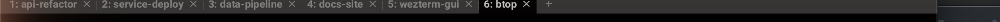
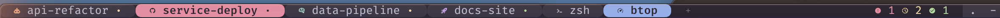

# Showcase

What this configuration changes, and which WezTerm features do the work.

Both screenshots below show the same six tabs in the same terminal: four
coding agents, a shell, and a process monitor. The only difference is the
configuration.

## WezTerm with no configuration

Numbered tabs, a close button on each, one system font, no colour beyond the
active-tab highlight. Every tab looks the same whatever is running inside it.

Note tab 5. It is a shell, but the label reads `wezterm-gui`: when a program
sets no title of its own, the tab falls back to the terminal's window title.

## WezTerm with this configuration

The same six tabs, and tab 5 is now correctly labelled `zsh`. Each tab carries
an icon for what is running, agents are
tinted by identity, and a state dot shows what each agent is doing. The tab
waiting on input is flipped to a solid colour so it reads from across the
screen, and a rollup on the right counts states across the whole window —
here one waiting, two working, one idle.

## Features used

| Feature | What it gives | Where |
|---------|---------------|-------|
| `format-tab-title` | Full control of tab content. Returns styled segments rather than a plain string, so each part can carry its own foreground, background and weight. | `wezterm/tabs/init.lua` |
| `use_fancy_tab_bar = false` | The retro tab bar renders in the main terminal font and lets a tab set its own background. The fancy bar uses a proportional system font, which has no Nerd Font coverage, and composites its own chrome over the title. | `wezterm/theme.lua` |
| `wezterm.nerdfonts` | Glyphs by name instead of pasted codepoints. A wrong name yields `nil`, which the agent validator reports at startup rather than rendering a mystery box. | `wezterm/tabs/processes.lua` |
| `wezterm.column_width`, `truncate_right` | Width-correct layout. Lua's `#` counts bytes: an ellipsis is 3 bytes but one cell, and every Nerd Font glyph is 3-4. Byte arithmetic both over-reserves space and can slice a codepoint in half. | `wezterm/tabs/init.lua` |
| OSC 1337 `SetUserVar` + `PaneInformation.user_vars` | A channel for a program inside a pane to report structured state to the terminal. This is how an agent tells the tab bar what it is doing. | `bin/wezterm-agent-state` |
| `user-var-changed` | Writing a user variable triggers a title update, which rebuilds the tab bar. State appears when it is reported rather than on a poll. | built in |
| `PaneInformation.has_unseen_output` | True when a pane produced output since it was last focused. A fallback attention signal that needs no cooperation from the program. | `wezterm/agents/state.lua` |
| `update-status` + `window:set_right_status` | The rollup on the right. Walks every tab and pane via `window:mux_window()`, reading the same variables the tab bar uses so the two cannot disagree. | `wezterm/status.lua` |
| `status_update_interval` | Bounds how often that walk runs. Set well above the human reaction time, since real state changes arrive through the event above. | `wezterm/status.lua` |
| `tab_bar_style` | Styles the retro bar's new-tab button to match the tabs. | `wezterm/tabs/init.lua` |
| `window_decorations = "INTEGRATED_BUTTONS\|RESIZE"` | Window controls inside the tab bar instead of a separate title bar. Works with the retro tab bar. | `wezterm/theme.lua` |
| `font_with_fallback` + `harfbuzz_features` | A Nerd Font with ligatures, and an ordered fallback chain so a machine missing the font still renders. | `wezterm/theme.lua` |
| Layered `config.background` | A background image with a colour wash over it, as two composited layers rather than a single tinted image. | `wezterm/theme.lua` |
| `enable_kitty_graphics` | Inline images in the terminal, for tools that render charts or previews. | `wezterm/theme.lua` |
| `front_end = "WebGpu"` | GPU rendering through the modern backend. | `wezterm/platform.lua` |

## Agent states

| State | Shown as |
|-------|----------|
| working | a dot in the working colour |
| idle | a dot in the idle colour |
| waiting on input | the whole tab flips to a solid colour |

State is reported by the program in the pane. Where nothing is reported, a tab
identified as an agent by user variable or process name falls back to unseen
output as a weaker signal, drawn with a smaller dot so a guess never looks
like a fact. A tab identified only by a title match gets an icon but no state,
since any program can print a matching title.

## Adding an agent

Agents are separate files. Adding one is a new file and a single line in the
registry; nothing in the renderer needs to change. See
[wezterm.md](wezterm.md) for the contract and the wiring for each supported
agent.
