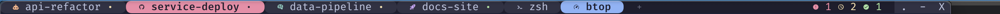

# Tab bar

The same six tabs — four coding agents, a shell and a process monitor — with
stock WezTerm and with this configuration. Only the config differs.

Numbered tabs, a close button each, one system font, no colour but the active
highlight. Tab 5 is a shell yet reads `wezterm-gui`: with no title set, the tab
falls back to the terminal's own window title.

Tab 5 is now `zsh`. Each tab carries an icon for what is running, agents are
tinted by identity, and a dot shows what each is doing — yellow working, green
idle. The tab waiting on input turns solid red, and the rollup on the right
counts states across the window.

A dot drawn smaller means the state was inferred from unseen output rather than
reported. A tab identified only by a title match gets an icon but never a
state, since any program can print a matching title.

## What does the work

`format-tab-title` returns styled segments rather than a string, so each part
carries its own colour. That needs the retro tab bar (`use_fancy_tab_bar =
false`, in `theme.lua`) — the fancy bar uses a proportional system font with no
Nerd Font coverage and draws its own chrome over whatever you return.

Agents report state by writing OSC 1337 `SetUserVar`, read back through
`PaneInformation.user_vars`. That write also rebuilds the tab bar, so state
appears when reported rather than on a poll. `has_unseen_output` supplies the
fallback signal, and `update-status` drives the rollup from the same variables
so the two cannot disagree.

Widths come from `column_width` and `truncate_right`: Lua's `#` counts bytes,
and an ellipsis is three bytes to one cell.

Lives in `wezterm/tabs/`, `wezterm/agents/` and `wezterm/status.lua`, with
colours from `wezterm/palette.lua`.

## Adding an agent

One new file plus one line in the registry; the renderer needs no changes.
[../wezterm.md](../wezterm.md) has the contract and the hook wiring per agent.
